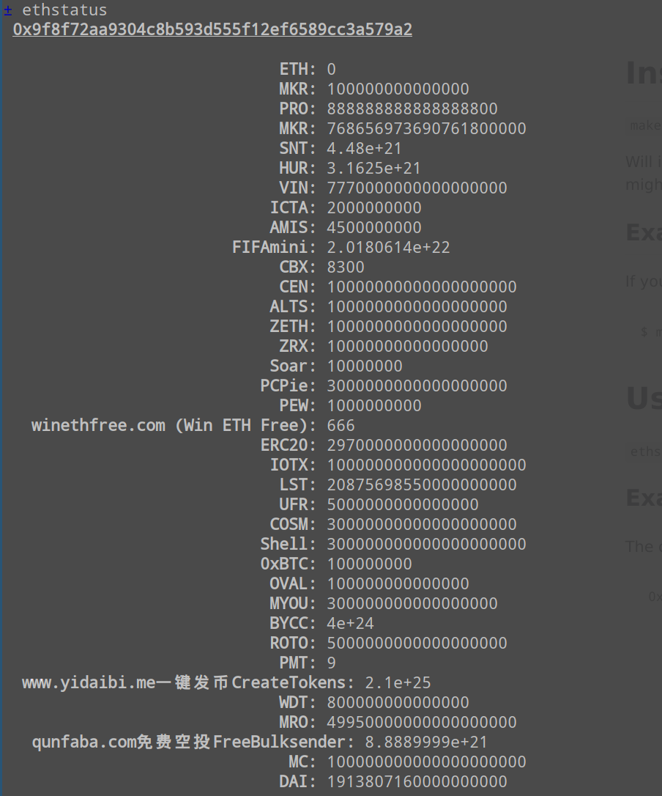

# Install

`make install ADDRESSES={COMMA SEPARATED LIST OF ADDRESSES}`

Will install npm ackages locally, and link the command `ethstatus`.
Depending on your linking location, that might require `sudo` (the installer will ask).

## Example

If you were looking to check the core MakerDAO contract, here's how you would install:

```
$ make install ADDRESSES=0x9f8f72aa9304c8b593d555f12ef6589cc3a579a2
```

# Usage

`ethstatus`

The output is adapted to the console, with simple formatting.
If you would like to pipe this into a script instead, feel free to open an issue or a PR.

## Example output:


